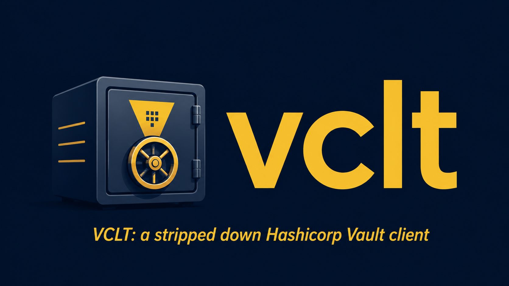

# vclt

A stripped-down, opinionated Hashicorp Vault client for KV v2 secret management, ACL policy management, token management, and basic server administration.

---

## Table of Contents

- [Overview](#overview)
- [Global Flags](#global-flags)
- [Authentication & Server Address Resolution](#authentication--server-address-resolution)
- [Commands](#commands)
  - [version](#version)
  - [completion](#completion)
  - [kv list](#kv-list)
  - [kv read](#kv-read)
  - [kv write](#kv-write)
  - [kv rm](#kv-rm)
  - [kv destroy](#kv-destroy)
  - [kv backup](#kv-backup)
  - [kv restore](#kv-restore)
  - [policy list](#policy-list)
  - [policy read](#policy-read)
  - [policy write](#policy-write)
  - [policy rm](#policy-rm)
  - [policy generate](#policy-generate)
  - [sys listmounts](#sys-listmounts)
  - [sys kvenable](#sys-kvenable)
  - [sys kvdisable](#sys-kvdisable)
  - [token create](#token-create)
  - [token revoke](#token-revoke)
  - [token renew](#token-renew)
  - [token lookup](#token-lookup)
  - [token self](#token-self)
  - [token accessors](#token-accessors)
  - [admin setrootkeys](#admin-setrootkeys)
  - [admin seal](#admin-seal)
  - [admin unseal](#admin-unseal)
- [Policy File Format](#policy-file-format)
- [Vault Policy Requirements](#vault-policy-requirements)
- [Building from Source](#building-from-source)
- [Running the Tests](#running-the-tests)
- [Binary Package Building](#binary-package-building)

---

## Overview

`vclt` wraps the [`vaultlib/v2`](https://github.com/jeanfrancoisgratton/vaultlib) library to expose a focused CLI covering the most common day-to-day Vault operations, organized in five command groups:

| Group | Purpose |
|---|---|
| `kv` | KV v2 secret management: read, write, list, delete, destroy, backup, restore |
| `policy` | ACL policy management: read, write, list, delete, plus sample-policy generation |
| `sys` | System operations: list mounts, enable/disable KV engines |
| `token` | Token management: create, revoke, renew, lookup, list accessors |
| `admin` | Server administration: seal, unseal, root-key storage |

Per-user configuration lives under `$HOME/.config/JFG/vclt/`, which is created automatically on first run.

---

## Global Flags

These flags are available on every command and subcommand.

| Flag | Short | Default | Description |
|---|---|---|---|
| `--token` | `-t` | — | Vault auth token. Overrides `VAULT_TOKEN` and `~/.vault-token`. |
| `--address` | `-a` | — | Vault server URL (e.g. `https://vault.example.com:8200`). Overrides `VAULT_ADDR`. |
| `--quiet` | `-q` | `false` | Suppress human-readable output (useful in scripts). |
| `--debug` | `-d` | `false` | Enable debug mode. |

> **Note:** `--output` / `-o` (`text` or `json`) is **not** a global flag. It is available only on the commands that support JSON output: `kv read`, `token lookup`, and `token self`.

---

## Authentication & Server Address Resolution

Every command that talks to Vault resolves the token and server address through the same lookup chain before making any API call.

**Token resolution** (`--token` / `-t`):
1. `-t` flag value, if provided.
2. `VAULT_TOKEN` environment variable.
3. Contents of `~/.vault-token` (whitespace-trimmed).
4. If none of the above yield a value, the command exits with `ERR_VAULTTOKENMISSING`.

**Server address resolution** (`--address` / `-a`):
1. `-a` flag value, if provided.
2. `VAULT_ADDR` environment variable.
3. If neither is set, the command exits with `ERR_VAULTADDRESSMISSING`.

> **Note:** `admin unseal` does not require a token — it only needs the server address, because an unsealing operation is performed against a sealed (i.e. unauthenticated) server.

---

## Commands

### version

```
vclt version
```

Prints the build version, release date, and the Go runtime version used to compile the binary.

**Token required:** No  
**Policy required:** None

---

### completion

```
vclt completion bash
vclt completion zsh
```

Generates shell completion scripts via Cobra. Output is written to stdout and can be redirected to the appropriate completion directory.

**Bash (current session):**
```sh
source <(vclt completion bash)
```

**Bash (persistent):**
```sh
vclt completion bash | sudo tee /etc/bash_completion.d/vclt > /dev/null
```

**Zsh:**
```sh
vclt completion zsh > ~/.zsh/vclt
echo 'fpath=($HOME/.zsh $fpath)' >> ~/.zshrc
echo 'autoload -Uz compinit && compinit' >> ~/.zshrc
```

**Token required:** No  
**Policy required:** None

---

### kv list

```
vclt kv list <KV_ENGINE>
vclt kv ls   <KV_ENGINE>
vclt kv show <KV_ENGINE>
```

Lists all secret paths available under the given KV v2 engine mount. Output is rendered as a sorted table. The `--extended` flag fetches and displays the latest version number for each secret.

| Flag | Short | Default | Description |
|---|---|---|---|
| `--extended` | `-x` | `false` | Include version numbers in the listing. |

**Example:**
```sh
vclt kv list mysecrets
vclt kv list mysecrets -x
```

**Token required:** Yes  
**Policy required:**
```hcl
path "<KV_ENGINE>/metadata/*" {
  capabilities = ["list"]
}
# With --extended, metadata reads are also performed:
path "<KV_ENGINE>/metadata/*" {
  capabilities = ["list", "read"]
}
```

---

### kv read

```
vclt kv read <KV_ENGINE> <SECRET_PATH>
vclt kv get  <KV_ENGINE> <SECRET_PATH>
```

Reads a secret from the KV v2 engine. Without `--field`, all key/value pairs in the secret are printed. With `--field`, only the value of the specified field is printed — useful for scripting.

| Flag | Short | Default | Description |
|---|---|---|---|
| `--field` | `-f` | — | Print only the value of the named field. |
| `--version` | `-v` | `0` | Read a specific version. `0` resolves to the latest available non-destroyed version. |
| `--output` | `-o` | `text` | Output format: `text` or `json`. |

**Examples:**
```sh
vclt kv read mysecrets db/credentials
vclt kv read mysecrets db/credentials -f password
vclt kv read mysecrets db/credentials -v 3
vclt kv read mysecrets db/credentials -o json
```

**Token required:** Yes  
**Policy required:**
```hcl
path "<KV_ENGINE>/data/<SECRET_PATH>" {
  capabilities = ["read"]
}
```

---

### kv write

```
vclt kv write <KV_ENGINE> <SECRET_PATH> <KEY> <VALUE>
vclt kv put   <KV_ENGINE> <SECRET_PATH> <KEY> <VALUE>
```

Writes a single key/value field to the secret at the given path. If the secret already exists, a new version is created (KV v2 versioning). If the path does not yet exist, it is created.

**Example:**
```sh
vclt kv write mysecrets db/credentials password s3cr3t
```

**Token required:** Yes  
**Policy required:**
```hcl
path "<KV_ENGINE>/data/<SECRET_PATH>" {
  capabilities = ["create", "update"]
}
```

---

### kv rm

```
vclt kv rm     <KV_ENGINE> <SECRET_PATH>
vclt kv delete <KV_ENGINE> <SECRET_PATH>
```

Soft-deletes a secret or a single field within a secret. A soft delete marks the version as deleted but retains the data; it can be undeleted if needed (KV v2 behaviour). When `--field` is specified, only that key is removed from the secret's data map, and a new version is written.

| Flag | Short | Default | Description |
|---|---|---|---|
| `--field` | `-f` | — | Delete only the named field from the secret. |
| `--version` | `-v` | `0` | Target a specific version for deletion. `0` targets the latest. |

**Examples:**
```sh
# Soft-delete the entire secret (latest version)
vclt kv rm mysecrets db/credentials

# Soft-delete a specific version
vclt kv rm mysecrets db/credentials -v 2

# Remove a single field
vclt kv rm mysecrets db/credentials -f password
```

**Token required:** Yes  
**Policy required:**
```hcl
# Whole-secret soft delete
path "<KV_ENGINE>/data/<SECRET_PATH>" {
  capabilities = ["delete"]
}
# Field-level delete (reads current data, rewrites without the field)
path "<KV_ENGINE>/data/<SECRET_PATH>" {
  capabilities = ["read", "update", "delete"]
}
```

---

### kv destroy

```
vclt kv destroy <KV_ENGINE> <SECRET_PATH>
```

Permanently destroys a secret version. Unlike `rm`, a destroy is irreversible — the secret data is permanently removed from Vault storage. The `--version` flag targets a specific version; without it, version `0` is passed to the underlying library (resolves to latest).

| Flag | Short | Default | Description |
|---|---|---|---|
| `--version` | `-v` | `0` | Permanently destroy the specified version. |

**Example:**
```sh
vclt kv destroy mysecrets db/old-credentials
vclt kv destroy mysecrets db/old-credentials -v 1
```

**Token required:** Yes  
**Policy required:**
```hcl
path "<KV_ENGINE>/destroy/<SECRET_PATH>" {
  capabilities = ["update"]
}
```

---

### kv backup

```
vclt kv backup <KV_ENGINE> <BACKUP_FILE[.json]>
vclt kv dump   <KV_ENGINE> <BACKUP_FILE[.json]>
```

Dumps the entire contents of a KV v2 engine to a backup file. By default the resulting file is **encoded** (via `helperFunctions/v5` file encoding) so secrets are not left in plaintext on disk; pass `--cleartext` to keep the raw JSON instead.

| Flag | Short | Default | Description |
|---|---|---|---|
| `--cleartext` | `-c` | `false` | Write the backup in cleartext JSON instead of encoded form. |

**Examples:**
```sh
vclt kv backup mysecrets mysecrets-backup.json
vclt kv backup mysecrets mysecrets-backup.json -c
```

**Token required:** Yes  
**Policy required:**
```hcl
path "<KV_ENGINE>/metadata/*" {
  capabilities = ["list", "read"]
}
path "<KV_ENGINE>/data/*" {
  capabilities = ["read"]
}
```

---

### kv restore

```
vclt kv restore <KV_ENGINE> <BACKUP_FILE[.json]>
vclt kv import  <KV_ENGINE> <BACKUP_FILE[.json]>
```

Restores a KV v2 engine from a backup file produced by `kv backup`. By default the file is assumed to be encoded; pass `--cleartext` if the backup was taken with `-c`.

| Flag | Short | Default | Description |
|---|---|---|---|
| `--cleartext` | `-c` | `false` | Read the backup as cleartext JSON instead of encoded form. |

**Example:**
```sh
vclt kv restore mysecrets mysecrets-backup.json
```

**Token required:** Yes  
**Policy required:**
```hcl
path "<KV_ENGINE>/data/*" {
  capabilities = ["create", "update"]
}
```

---

### policy list

```
vclt policy list
vclt policy ls
vclt policy show
```

Lists all ACL policies defined on the server. `policies` is accepted as an alias for the `policy` group on every subcommand.

**Token required:** Yes  
**Policy required:**
```hcl
path "sys/policies/acl" {
  capabilities = ["list"]
}
```

---

### policy read

```
vclt policy read <POLICY_NAME>
vclt policy get  <POLICY_NAME>
```

Displays the rules of the named ACL policy.

**Token required:** Yes  
**Policy required:**
```hcl
path "sys/policies/acl/<POLICY_NAME>" {
  capabilities = ["read"]
}
```

---

### policy write

```
vclt policy write <POLICY_NAME> <POLICY_FILE>
vclt policy put   <POLICY_NAME> <POLICY_FILE>
```

Creates or updates the named ACL policy from a local file. The file format is selected by extension: `.hcl` is parsed as HCL, anything else as JSON. The file is **validated locally before being submitted to Vault** — see [Policy File Format](#policy-file-format) for the checks performed.

**Examples:**
```sh
vclt policy write app-readonly app-readonly.hcl
vclt policy write app-readonly app-readonly.json
```

**Token required:** Yes  
**Policy required:**
```hcl
path "sys/policies/acl/<POLICY_NAME>" {
  capabilities = ["create", "update"]
}
```

---

### policy rm

```
vclt policy rm     <POLICY_NAME> [POLICY_NAME...]
vclt policy delete <POLICY_NAME> [POLICY_NAME...]
```

Deletes one or more ACL policies. Multiple policy names can be given in a single invocation.

**Example:**
```sh
vclt policy rm old-policy1 old-policy2
```

**Token required:** Yes  
**Policy required:**
```hcl
path "sys/policies/acl/<POLICY_NAME>" {
  capabilities = ["delete"]
}
```

---

### policy generate

```
vclt policy generate <FILENAME>
vclt policy gen      <FILENAME>
vclt policy sample   <FILENAME>
```

Generates a sample ACL policy file to use as a starting point for writing your own. The output format is selected by extension: a `.json` filename produces a JSON sample; any other name produces an HCL sample (with `.hcl` appended if the extension is missing).

**Examples:**
```sh
vclt policy generate mypolicy          # writes mypolicy.hcl
vclt policy generate mypolicy.json     # writes JSON sample
```

**Token required:** No (local file generation only)  
**Policy required:** None

---

### sys listmounts

```
vclt sys listmounts
vclt sys mounts
```

Lists all mounts (secret engines) on the server, in a sorted table showing path, type, KV version, and description.

**Token required:** Yes  
**Policy required:**
```hcl
path "sys/mounts" {
  capabilities = ["read"]
}
```

---

### sys kvenable

```
vclt sys kvenable <KVENGINE_NAME> [-V version] [-D description]
vclt sys enablekv <KVENGINE_NAME>
```

Enables (mounts) a new KV secret engine at the given path.

| Flag | Short | Default | Description |
|---|---|---|---|
| `--version` | `-V` | `2` | KV engine version (1 or 2). |
| `--desc` | `-D` | — | KV engine description. |

**Example:**
```sh
vclt sys kvenable mysecrets -D "application secrets"
```

**Token required:** Yes  
**Policy required:**
```hcl
path "sys/mounts/<KVENGINE_NAME>" {
  capabilities = ["create", "update"]
}
```

---

### sys kvdisable

```
vclt sys kvdisable <KVENGINE_NAME> [-y]
vclt sys disablekv <KVENGINE_NAME>
```

Disables (unmounts) a KV secret engine. **This is irreversible and destroys all data in the engine**, so an interactive Y/N confirmation is required unless `-y` is passed.

| Flag | Short | Default | Description |
|---|---|---|---|
| `--yes` | `-y` | `false` | Skip the interactive confirmation. |

**Example:**
```sh
vclt sys kvdisable oldsecrets
vclt sys kvdisable oldsecrets -y      # no confirmation, for scripts
```

**Token required:** Yes  
**Policy required:**
```hcl
path "sys/mounts/<KVENGINE_NAME>" {
  capabilities = ["delete"]
}
```

---

### token create

```
vclt token create <TOKEN_NAME>
vclt token write  <TOKEN_NAME>
```

Creates a new token with the given display name. By default the token is **orphaned** and **renewable**, with a 1-hour TTL, bound to the `default` policy. The TTL is validated locally before any API call: it must be a Go duration string (`"30m"`, `"1h"`, `"24h"`) or a non-negative integer number of seconds. `tokens` is accepted as an alias for the `token` group on every subcommand.

On success, the token, its accessor, policies, TTL, and flags are printed; `--file` additionally saves the full token information to a JSON file (mode `0600`, `.json` appended if missing).

| Flag | Short | Default | Description |
|---|---|---|---|
| `--policies` | `-P` | `default` | Comma-separated list of policies to bind to the token. |
| `--ttl` | `-T` | `1h` | Token TTL. |
| `--orphaned` | `-o` | `true` | Create the token as orphaned (no parent). |
| `--renewable` | `-r` | `true` | Create the token as renewable. |
| `--file` | `-f` | — | Save the token information to the given JSON file. |

**Examples:**
```sh
vclt token create ci-deploy -P deploy-policy,read-policy -T 24h
vclt token create ci-deploy -f ci-deploy-token
```

**Token required:** Yes  
**Policy required:**
```hcl
path "auth/token/create" {
  capabilities = ["create", "update"]
}
# Orphan tokens (the default) additionally require:
path "auth/token/create-orphan" {
  capabilities = ["create", "update"]
}
```

---

### token revoke

```
vclt token revoke <TOKEN>
vclt token remove <TOKEN>
vclt token delete <TOKEN>
```

Permanently revokes a token. If the token has child tokens, they are revoked as well.

**Token required:** Yes  
**Policy required:**
```hcl
path "auth/token/revoke" {
  capabilities = ["update"]
}
```

---

### token renew

```
vclt token renew <TOKEN> [-d duration]
```

Renews a renewable token's lease.

| Flag | Short | Default | Description |
|---|---|---|---|
| `--duration` | `-d` | `0` | New lease duration in seconds. `0` uses the server default (1h). |

**Token required:** Yes  
**Policy required:**
```hcl
path "auth/token/renew" {
  capabilities = ["update"]
}
```

---

### token lookup

```
vclt token lookup <TOKEN>
```

Displays detailed information about the given token: ID, accessor, creation/expiry times, TTLs, use count, orphan/renewable flags, policies, type, metadata, and entity ID.

| Flag | Short | Default | Description |
|---|---|---|---|
| `--output` | `-o` | `text` | Output format: `text` or `json`. |
| `--file` | `-f` | — | Save the token information to the given JSON file. |

**Token required:** Yes  
**Policy required:**
```hcl
path "auth/token/lookup" {
  capabilities = ["update"]
}
```

---

### token self

```
vclt token self
```

Displays the same detailed information as `token lookup`, but for the token you are currently authenticated with.

| Flag | Short | Default | Description |
|---|---|---|---|
| `--output` | `-o` | `text` | Output format: `text` or `json`. |
| `--file` | `-f` | — | Save the token information to the given JSON file. |

**Token required:** Yes  
**Policy required:** None beyond the `default` policy (`auth/token/lookup-self` is granted by default).

---

### token accessors

```
vclt token accessors
```

Lists all token accessors known to the server. Accessors can be used with `token lookup` and `token revoke` without knowing the token values themselves.

**Token required:** Yes  
**Policy required:**
```hcl
path "auth/token/accessors" {
  capabilities = ["list", "sudo"]
}
```

---

### admin setrootkeys

```
vclt admin setrootkeys [filename] [--offline]
```

Interactively collects the unseal key shards for a Vault initialized with Shamir secret sharing and saves them to a JSON file under `$HOME/.config/JFG/vclt/` (mode `0600`). If no filename is provided, `rootkeys.json` is used. A `.json` extension is appended automatically if omitted.

Unless `--offline` is given, the command queries the Vault server for its current seal threshold (`minimumRequired`) and refuses to save a file that contains fewer key shards than that threshold. With `--offline`, no server contact is made and the threshold check is skipped — useful when preparing the file before the server is reachable.

Key shards (and the optional initial root key) are stored encoded (via `helperFunctions/v5` `EncodeString`) — they are not stored in plaintext.

| Flag | Short | Default | Description |
|---|---|---|---|
| `--offline` | `-o` | `false` | Do not contact the server; skip the seal-threshold check. |

**Example:**
```sh
vclt admin setrootkeys
vclt admin setrootkeys prod-keys
vclt admin setrootkeys prod-keys --offline
```

**Token required:** No (the seal-status endpoint is unauthenticated; with `--offline`, no server contact at all)  
**Policy required:** None

---

### admin seal

```
vclt admin seal
```

Seals the Vault server. Once sealed, all secrets become inaccessible until the server is unsealed again.

**Example:**
```sh
vclt admin seal
vclt -a https://vault.example.com:8200 -t hvs.xxxx admin seal
```

**Token required:** Yes  
**Policy required:**
```hcl
path "sys/seal" {
  capabilities = ["update", "sudo"]
}
```

---

### admin unseal

```
vclt admin unseal [filename]
```

Unseals a sealed Vault using the key shards previously saved by `admin setrootkeys`. If no filename is provided, `$HOME/.config/JFG/vclt/rootkeys.json` is used. The command decodes the stored key shards and submits exactly `minimumRequired` of them to the Vault unseal endpoint.

**Example:**
```sh
vclt admin unseal
vclt admin unseal prod-keys.json
```

**Token required:** No (unsealing operates against a sealed, unauthenticated server)  
**Policy required:** None (unauthenticated endpoint — `sys/unseal` is always accessible on a sealed node)

---

## Policy File Format

`policy write` accepts policy files in **HCL** (`.hcl` extension) or **JSON** (any other extension). Use `policy generate` to produce a starting sample in either format.

Both formats are validated locally before anything is sent to Vault. The validator enforces:

- At least one `path` entry must be defined.
- `capabilities` is required, non-empty, and limited to Vault's vocabulary: `create`, `read`, `update`, `delete`, `list`, `patch`, `sudo`, `deny`.
- `deny` is mutually exclusive with all other capabilities.
- In `allowed_parameters` / `denied_parameters`, the wildcard key `"*"` must map to an empty value list.
- `min_wrapping_ttl` / `max_wrapping_ttl` must be valid TTLs — a Go duration string (`"5m"`, `"1h30m"`) or a non-negative integer number of seconds — and when both are set, min must be strictly less than max.
- `mfa_methods`, when present, must not be an empty list.

HCL input is re-formatted through the canonical HCL printer before submission; JSON input is validated against the full rule schema and re-marshaled in canonical form.

**Minimal JSON example:**
```json
{
  "path": {
    "mysecrets/data/app/*": {
      "capabilities": ["read", "list"]
    }
  }
}
```

**Minimal HCL example:**
```hcl
path "mysecrets/data/app/*" {
  capabilities = ["read", "list"]
}
```

---

## Vault Policy Requirements

Summary table for quick reference. All secret operations assume a KV v2 engine.

| Command | Vault path | Capabilities |
|---|---|---|
| `kv list` | `<engine>/metadata/*` | `list` |
| `kv list -x` | `<engine>/metadata/*` | `list`, `read` |
| `kv read` | `<engine>/data/<path>` | `read` |
| `kv write` | `<engine>/data/<path>` | `create`, `update` |
| `kv rm` (whole) | `<engine>/data/<path>` | `delete` |
| `kv rm` (field) | `<engine>/data/<path>` | `read`, `update`, `delete` |
| `kv destroy` | `<engine>/destroy/<path>` | `update` |
| `kv backup` | `<engine>/metadata/*`, `<engine>/data/*` | `list`, `read` |
| `kv restore` | `<engine>/data/*` | `create`, `update` |
| `policy list` | `sys/policies/acl` | `list` |
| `policy read` | `sys/policies/acl/<name>` | `read` |
| `policy write` | `sys/policies/acl/<name>` | `create`, `update` |
| `policy rm` | `sys/policies/acl/<name>` | `delete` |
| `sys listmounts` | `sys/mounts` | `read` |
| `sys kvenable` | `sys/mounts/<engine>` | `create`, `update` |
| `sys kvdisable` | `sys/mounts/<engine>` | `delete` |
| `token create` | `auth/token/create[-orphan]` | `create`, `update` |
| `token revoke` | `auth/token/revoke` | `update` |
| `token renew` | `auth/token/renew` | `update` |
| `token lookup` | `auth/token/lookup` | `update` |
| `token self` | `auth/token/lookup-self` | — (default policy) |
| `token accessors` | `auth/token/accessors` | `list`, `sudo` |
| `admin setrootkeys` | `sys/seal-status` | — (unauthenticated) |
| `admin seal` | `sys/seal` | `update`, `sudo` |
| `admin unseal` | `sys/unseal` | — (unauthenticated) |

---

## Building from Source

### Requirements

- Go **1.26.4** or later (see `go.mod`)
- Network access to the Go module proxy (or a pre-populated module cache)

### Dependencies

Direct dependencies are managed via `go.mod`:

| Module | Version |
|---|---|
| `github.com/jeanfrancoisgratton/customError/v3` | v3.0.0 |
| `github.com/jeanfrancoisgratton/helperFunctions/v5` | v5.3.0 |
| `github.com/jeanfrancoisgratton/vaultlib/v2` | v2.0.0 |
| `github.com/jedib0t/go-pretty/v6` | v6.8.2 |
| `github.com/spf13/cobra` | v1.10.2 |
| `golang.org/x/term` | v0.44.0 |

### Quick build

```sh
cd src
go mod download
go build -o vclt .
```

### Using `build.sh`

The `build.sh` script at the repo root adds branch-aware output naming and optional permission checks on the target directory. The default output path is `/opt/bin`.

```sh
# Build to the default output path (/opt/bin)
./build.sh

# Build to a custom output path
./build.sh ~/bin

# Build with output directory permission check (expects group 'devops', mode 775)
./build.sh --checkperms
./build.sh ~/bin --checkperms
```

When the current Git branch is `master`, `main`, or `develop`, the binary is named `vclt`. On any other branch it is named `vclt-<branch>`, which avoids overwriting a stable binary during feature development.

### Static build (CGO disabled)

All packaging targets build with CGO disabled for maximum portability:

```sh
cd src
CGO_ENABLED=0 go build -trimpath -ldflags="-s -w -buildid=" -o vclt .
```

---

## Running the Tests

Unit tests live alongside the code in `*_test.go` files and require no running Vault server.

```sh
cd src
go test ./...          # run everything
go test -v ./policies/ # verbose output for one package
go test -cover ./...   # with statement coverage
```

---

## Binary Package Building

Packaging stubs for Alpine (APK), Arch Linux (PKGBUILD), Debian (DEB), and Red Hat/RHEL/Fedora (RPM) are provided under `__alpine/`, `__archlinux/`, `__debian/`, and `__redhat/` respectively.

All package formats are built inside dedicated Docker containers. The following container images are required:

| Container | Format |
|---|---|
| `apkbuilder` | Alpine APK |
| `archbuilder` | Arch Linux PKGBUILD |
| `debbuilder` | Debian/Ubuntu DEB |
| `rpmbuilder` | Red Hat / Fedora RPM |

> **Note:** The Docker build contexts for these containers are not provided in this repository and are not intended for distribution outside of the author's own environment. The containers are assumed to be available locally.

### RPM

The `__redhat/` directory contains a `Makefile` that drives the full RPM workflow.

```sh
cd __redhat

# Create the source tarball (git archive of HEAD)
make tarball

# Build the RPM (includes tarball step)
make rpm

# Build the RPM and update the %changelog from git log
make rpmcl

# Upload the built RPM to the configured Nexus repository
make upload

# Commit the updated spec file (after changelog update)
make commitcl
```

The changelog can also be updated standalone via `__redhat/updateChangelog.sh`.

### Debian

```sh
cd __debian
./1.install-build-deps.sh   # install Go and build toolchain inside the debbuilder container
./2.build_binary.sh         # compile and package the .deb
./3.restore_repo.sh         # restore the local apt repository
```

### Alpine

The `__alpine/APKBUILD` follows the standard `abuild` workflow. It copies the `src/` tree into the build directory, disables CGO, and builds a statically linked binary installed to `/opt/bin/vclt`. Post-install hooks register bash and zsh completions automatically.

### Arch Linux

```sh
cd __archlinux
./1.install-build-deps.sh   # install Go inside the archbuilder container
./2.build-package.sh        # run makepkg and produce the .pkg.tar.zst
```
